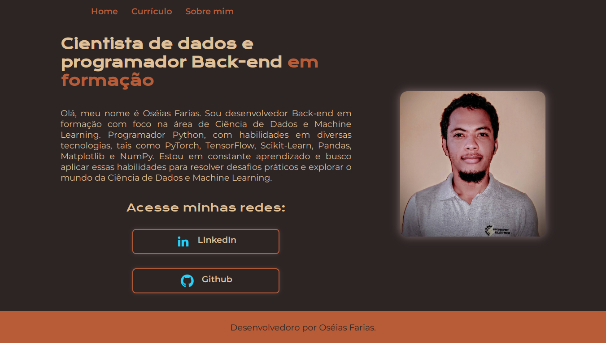

# Portifólio

Projeto focado na criação de um portifólio usando tecnologias de front-end, HTML e CSS, visando entender essas ferramentas tão importante para o mercado de desenvolvimento de softwares.

Esse projeto foi desenvolvido na formação, Iniciante em Programação T6 - ONE, do programa OracleNextEducation da Oracle em parceria com a Alura, Alura Latam, com foco no aprimoramento das hard skills.

[Repositório GitHub](https://github.com/Oseiasdfarias/portifolio_curso_alura)

[Portifólio ](https://portifolio-curso-alura-omega.vercel.app)

